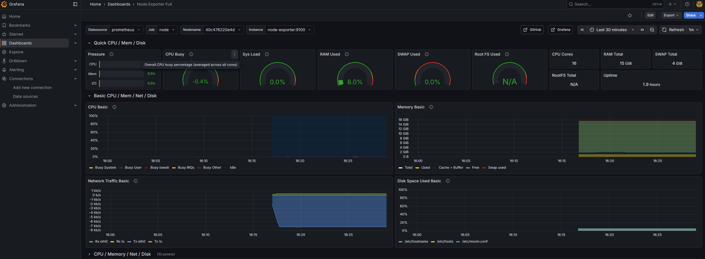

# 🛠 Ansible & DevOps Playground

Репозиторий демонстрирует навыки управления инфраструктурой как кодом (IaC), контейнеризации и настройки систем мониторинга в Enterprise-среде.

## 📂 Технологический стек
* **IaC**: Ansible (плейбуки для автоматизированного деплоя и проверок).
* **Orchestration**: Docker Compose (оркестрация стека мониторинга).
* **App Layer**: Flask API (`app.py`) + SQL схема (`database.sql`).
* **Observability**: Prometheus + Grafana + Node Exporter.

## 📋 Основные сценарии

### 1. Автоматизация развертывания (Ansible)
- **`install_nginx.yml`**: Полный цикл установки и настройки веб-сервера.
- **`check_grafana.yml`**: Автоматическая валидация доступности Grafana API после деплоя (Health Check).

### 2. Контейнеризация и Мониторинг (Docker)
Стек мониторинга собирает метрики системы в реальном времени:
- **Prometheus**: Сбор и хранение временных рядов.
- **Node Exporter**: Экспорт системных метрик (CPU, RAM, Disk).
- **Grafana**: Визуализация данных (пароль задается через переменные окружения в `.env`).

### 3. Слой приложения (Backend & DB)
- **`app.py`**: Легковесное API на Python для имитации сервиса.
- **`database.sql`**: Спроектированная схема для хранения событий системы.

## 🚀 Быстрый старт
1. **Подготовка**: Скопируйте `hosts.ini` и создайте `.env` с паролями.
2. **Запуск мониторинга**: 
```bash
   docker-compose up -d
   ```

3. **Запуск автоматизации**:
 ```bash
 ansible-playbook -i hosts.ini install_nginx.yml -K
 ```


