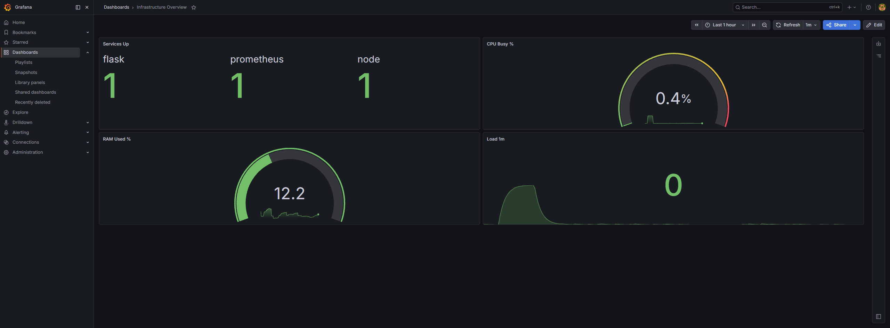
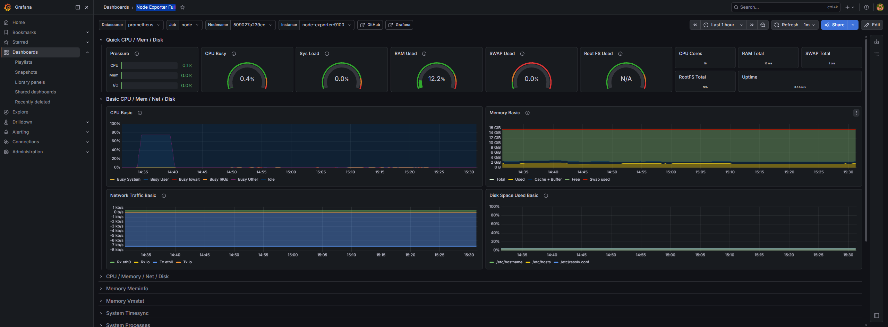
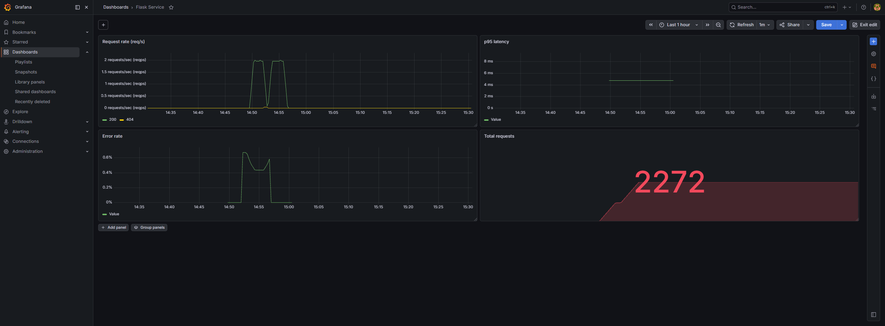
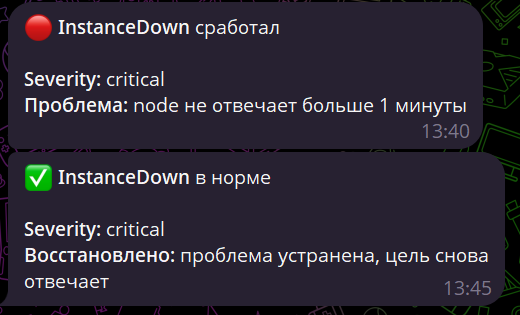

# Ansible & Monitoring Playground


Observability-стенд на Docker Compose: Prometheus, Grafana, Node Exporter, Alertmanager и Flask-сервис с метриками. Алерты уходят в Telegram (отдельный текст для firing и resolved). Плюс Ansible-плейбуки для провижининга Nginx и hardening хоста.

## Архитектура

```
node-exporter ─┐
flask /metrics ─┼─► Prometheus ──► Alertmanager ──► Telegram
prometheus ────┘        │
                        └──► Grafana
```

## Структура

```
ansible-playground/
├── install_nginx.yml       # установка и настройка Nginx
├── harden_sysctl.yml       # sysctl hardening + лимиты для агентов мониторинга
├── check_grafana.yml       # health-check Grafana (until/retries)
├── hosts.ini
├── monitoring/             # docker-compose: Prometheus, Grafana, node-exporter, Alertmanager
└── flask-exporter/         # Flask-сервис, отдаёт метрики на /metrics
```

## Запуск

```bash
cd monitoring
cp .env.example .env                            # учётные данные Grafana
cp alertmanager.yml.example alertmanager.yml    # вписать bot_token и chat_id
docker compose up -d --build
```

| Сервис        | URL                           |
|---------------|-------------------------------|
| Grafana       | http://localhost:3000         |
| Prometheus    | http://localhost:9090         |
| Alertmanager  | http://localhost:9093         |
| Node Exporter | http://localhost:9100/metrics |
| Flask         | http://localhost:5000         |

> Секреты (`alertmanager.yml`, `.env`) в `.gitignore`. В репозиторий попадают только `*.example`.

## Дашборды Grafana

**Infrastructure Overview** — сводка: статусы целей, CPU, RAM, load



**Node Exporter Full (ID 1860)** — CPU, память, диск, сеть хоста



**Flask Service (RED)** — Request rate, Error rate, Duration (p95)



## Алертинг

| Алерт            | Условие                                  | Severity |
|------------------|------------------------------------------|----------|
| `InstanceDown`   | `up == 0` дольше 1 минуты                 | critical |
| `HighCPUUsage`   | CPU > 80% в течение 5 минут               | warning  |
| `HighMemoryUsage`| RAM > 85% в течение 5 минут               | warning  |

Проверка вживую:

```bash
docker stop alpha_node_exporter      # через минуту прилетит FIRING
docker start alpha_node_exporter     # прилетит RESOLVED
```



## Ansible

```bash
ansible-playbook -i hosts.ini install_nginx.yml -K     # Nginx: worker_processes, server_tokens off
ansible-playbook -i hosts.ini harden_sysctl.yml -K     # сетевой hardening + лимиты fanotify/inotify
ansible-playbook -i hosts.ini check_grafana.yml        # ожидание готовности Grafana
```

## Заметки

- `check_grafana.yml` использует `until/retries`: Grafana стартует ~10 секунд, без ожидания задача падает на race condition.
- Под WSL2 node-exporter читает собственный `/proc` (host-mount `/proc` через границу docker-демона не пробрасывается). Метрики CPU/RAM/load корректны, мониторинг диска ограничен. На реальном Linux-хосте проброс возвращается.
